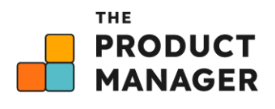

Подборка лучших шаблонов **product roadmap** -- от классических планов до гибких Agile-досок. Эти материалы помогут наглядно спланировать развитие продукта, синхронизировать команду и держать фокус на приоритетах. Внутри -- ссылки на проверенные источники, где можно скачать и адаптировать шаблон под свои задачи.

<note type="info">

[***Инструменты продакта***](https://t.me/tools_pm) *-- канал о сервисах, шаблонах и приёмах, которые экономят время продакта.*

</note>

### Что внутри:

-  [Шаблоны roadmap от Miro](./roadmap#%E2%80%94%D1%88%D0%B0%D0%B1%D0%BB%D0%BE%D0%BD%D1%8B-roadmap-%D0%BE%D1%82-miro)

-  [20+ шаблонов roadmap для продуктовых команд от Aha!](./roadmap#-20+-%D1%88%D0%B0%D0%B1%D0%BB%D0%BE%D0%BD%D0%BE%D0%B2-roadmap-%D0%B4%D0%BB%D1%8F-%D0%BF%D1%80%D0%BE%D0%B4%D1%83%D0%BA%D1%82%D0%BE%D0%B2%D1%8B%D1%85-%D0%BA%D0%BE%D0%BC%D0%B0%D0%BD%D0%B4-%D0%BE%D1%82-aha!)

-  [Бесплатные шаблоны roadmap от Notion](./roadmap#%E2%80%94%D0%B1%D0%B5%D1%81%D0%BF%D0%BB%D0%B0%D1%82%D0%BD%D1%8B%D0%B5-%D1%88%D0%B0%D0%B1%D0%BB%D0%BE%D0%BD%D1%8B-roadmap-%D0%BE%D1%82-notion)

-  [Шаблон roadmap от Asana](./roadmap#-%D1%88%D0%B0%D0%B1%D0%BB%D0%BE%D0%BD-roadmap-%D0%BE%D1%82-asana)

-  [6 бесплатных шаблонов roadmap от TheProductManager.com](./roadmap#-6-%D0%B1%D0%B5%D1%81%D0%BF%D0%BB%D0%B0%D1%82%D0%BD%D1%8B%D1%85-%D1%88%D0%B0%D0%B1%D0%BB%D0%BE%D0%BD%D0%BE%D0%B2-roadmap-%D0%BE%D1%82-theproductmanager.com)

-  [Шаблон roadmap от ChatPRD](./roadmap#-%D1%88%D0%B0%D0%B1%D0%BB%D0%BE%D0%BD-roadmap-%D0%BE%D1%82-chatprd)

-  [Шаблон roadmap от Atlassian](./roadmap#-%D1%88%D0%B0%D0%B1%D0%BB%D0%BE%D0%BD-roadmap-%D0%BE%D1%82-atlassian)

-  [Agile-шаблоны roadmap от ProductPlan](./roadmap#-agile-%D1%88%D0%B0%D0%B1%D0%BB%D0%BE%D0%BD%D1%8B-roadmap-%D0%BE%D1%82-productplan)

-  [7 примеров и шаблонов roadmap от Product School](./roadmap#-7-%D0%BF%D1%80%D0%B8%D0%BC%D0%B5%D1%80%D0%BE%D0%B2-%D0%B8-%D1%88%D0%B0%D0%B1%D0%BB%D0%BE%D0%BD%D0%BE%D0%B2-roadmap-%D0%BE%D1%82-product-school)

-  [Бесплатные шаблоны roadmap от Smartsheet](./roadmap#-%D0%B1%D0%B5%D1%81%D0%BF%D0%BB%D0%B0%D1%82%D0%BD%D1%8B%D0%B5-%D1%88%D0%B0%D0%B1%D0%BB%D0%BE%D0%BD%D1%8B-roadmap-%D0%BE%D1%82-smartsheet)

-  [Примеры и шаблоны roadmap от Figma](./roadmap#-%D0%BF%D1%80%D0%B8%D0%BC%D0%B5%D1%80%D1%8B-%D0%B8-%D1%88%D0%B0%D0%B1%D0%BB%D0%BE%D0%BD%D1%8B-roadmap-%D0%BE%D1%82-figma)

---

#### {width=225px height=104px}  Шаблоны roadmap от Miro

Подборка шаблонов для планирования и визуализации развития продукта -- от запуска до зрелости. В коллекции есть как классические дорожные карты, так и примеры от сообщества Miro, которые помогают видеть полную картину, соблюдать сроки и держать фокус на ключевых этапах. Все шаблоны легко настраиваются под ваши процессы.\
**Ссылка:** <https://miro.com/templates/product-roadmap/>

---

#### {width=167px height=80px} 20+ шаблонов roadmap для продуктовых команд от Aha!

Более 20 шаблонов дорожных карт с примерами и инструкциями, как их адаптировать под разные команды и аудитории. Подборка поможет быстро визуализировать стратегические планы, выбрать нужный формат и понять, какие элементы включить. Подходит для продуктовых менеджеров и команд, которым важно видеть весь путь продукта и действовать по плану.\
**Ссылка:** <https://www.aha.io/roadmapping/guide/templates/product-roadmap>

---

#### {width=76px height=71px}  Бесплатные шаблоны roadmap от Notion

Бесплатные шаблоны дорожных карт для стратегического планирования и управления этапами разработки. Включают итерационные планы, детализированные релиз-планы и фиче-роудмапы с элементами Agile. Подходят для выстраивания гибкой, но структурированной стратегии продукта, с наглядными картами целей и этапов. Легко адаптируются под задачи команды в Notion.\
**Ссылка:** <https://www.notion.com/templates/category/free-product-roadmap-templates>

---

#### {width=222px height=76px} Шаблон roadmap от Asana

Бесплатный шаблон для отслеживания и планирования продуктовых инициатив от разработки до запуска. Помогает видеть грядущие релизы на высоком уровне, синхронизировать команду, достигать ключевых вех и концентрироваться на приоритетных задачах. Создает повторяемый процесс построения roadmap, чтобы быстрее переходить к работе. \
**Ссылка:** <https://asana.com/ru/templates/product-roadmap>

---

#### {width=275px height=109px} 6 бесплатных шаблонов roadmap от TheProductManager.com

Подборка из 6 бесплатных шаблонов дорожных карт для разных сценариев -- от долгосрочного стратегического планирования до краткосрочных релиз-планов. Помогает выбрать подходящий формат под ваш продукт и команду, чтобы все участники были на одной волне и работали согласованно. \
**Ссылка:** <https://theproductmanager.com/topics/product-roadmap-template/>

---

#### {width=288px height=96px} Шаблон roadmap от ChatPRD

Стратегический шаблон для построения детализированного и привязанного ко времени плана развития продукта. Помогает объединить всех стейкхолдеров вокруг общей цели, эффективно распределить ресурсы, приоритизировать фичи и отслеживать ключевые вехи. Удобен для прозрачной коммуникации продуктовой стратегии и контроля прогресса. *Подборка от «Инструментов продакта».*\
**Ссылка:** <https://www.chatprd.ai/templates/product-roadmap-template>

---

#### {width=286px height=71px} Шаблон roadmap от Atlassian

Шаблон для перевода продуктовых идей в конкретные релизы. Позволяет зафиксировать, спланировать и отслеживать все запланированные фичи, создавая наглядный обзор будущих запусков. Удобен для презентации руководству и другим командам, чтобы все были в курсе приоритетов и прогресса. *Подборка от «Инструментов продакта».*\
**Ссылка:** <https://www.atlassian.com/ru/software/confluence/templates/product-roadmap>

---

#### {width=367px height=86px} Agile-шаблоны roadmap от ProductPlan

Шаблон для команд, работающих по Agile, помогает визуализировать стратегию продукта на высоком уровне. Позволяет согласовать бэклоги, приоритизировать задачи и эффективно коммуницировать планы с командой и стейкхолдерами. Подходит для гибкой адаптации под различные этапы разработки.\
**Ссылка:** <https://www.productplan.com/templates/>

---

#### {width=331px height=94px} 7 примеров и шаблонов roadmap от Product School

Создание дорожной карты продукта -- необходимый шаг для успешного развития продукта. В подборке 7 проверенных экспертами примеров, которые демонстрируют различные подходы к планированию и инновациям. Каждая дорожная карта помогает оптимизировать процесс планирования, согласовать команду и держать фокус на приоритетах.\
**Ссылка:** <https://productschool.com/blog/product-strategy/product-roadmap-examples>

---

#### {width=337px height=86px} Бесплатные шаблоны roadmap от Smartsheet

Подборка бесплатных шаблонов для планирования развития продукта, включая прогнозирование релизов, бюджетов и сроков, а также согласование ожиданий стейкхолдеров. Шаблоны доступны в Excel, Word, PowerPoint и в Smartsheet с возможностью настройки и совместной работы в реальном времени.\
**Ссылка:** [https://www.smartsheet.com/free-product-roadmap-templates-smartsheet](https://www.smartsheet.com/free-product-roadmap-templates-smartsheet?ysclid=me31j2jbgy129804989)

---

#### {width=221px height=66px} Примеры и шаблоны roadmap от Figma

Подборка шаблонов для стратегического планирования и приоритизации развития продукта. Позволяет визуализировать дорожную карту продукта, синхронизировать команду и планировать ключевые этапы. Все шаблоны легко настраиваются в Figma/ FigJam.\
**Ссылка:** <https://www.figma.com/community/strategic-planning/product-roadmaps?editor_type=figjam>

---